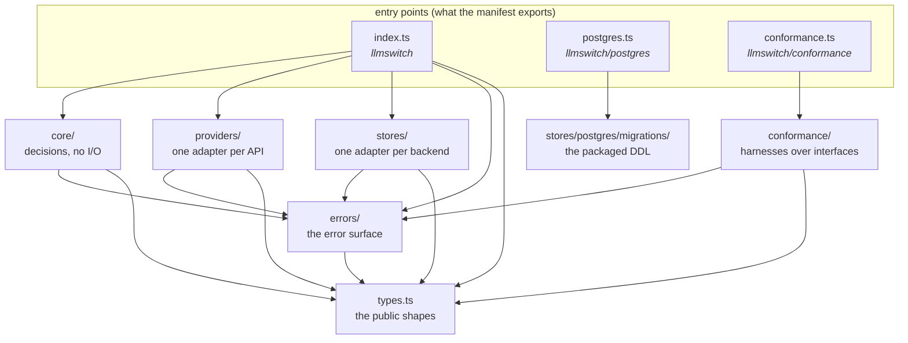

# Architecture

This is the map of `src/`. It exists so that "where does this go?" has an answer before
the code is written, and so that the answer is checked rather than remembered:
`npm run depcruise` fails on any import the diagram below does not show.

The specification in [`spec.md`](spec.md) says what the package does. This file says how
the pieces are arranged so it can keep doing it.

## The shape

Every arrow points down the same slope, so the graph has no cycles, and the layer that
changes most often — the adapters — sits where nothing depends on it.

## What each folder is for

**`types.ts`** is the floor: every shape the package publishes, declared once from spec §6,
importing nothing but Zod.

**`errors/`** is the bottom layer of behaviour. Two public classes: `LLMSwitchError`, with a
closed set of codes, the typed factories that construct it, and the literal `retryable` of
the spec §5b classification row — the row, not the code, since `PROVIDER_FAILED` is retryable
for a `transient` failure and not for a `refused` one; and `ProviderError`, which an adapter
throws to classify a failed call and which is recognised by a brand rather than by
`instanceof`. Everything may depend on it; it depends on nothing but the public types.

**`core/`** decides. The run state machine, config resolution and its cache, failure
classification, the quota lifecycle. It is pure: no HTTP, no SQL, no Node built-ins at
all. It reaches storage and providers only through the interfaces they implement, which
is why it never needs editing when either gains a member.

**`providers/`** holds one adapter per provider API. Each one translates a request into
that API's wire format, sends it with global `fetch`, and translates what comes back —
including failures — into the shared shapes. An adapter reports; it does not decide
whether to fall back or whether a quota allows the call.

**`stores/`** holds one adapter per storage backend, implementing the config store and the
usage store. A store persists and counts; it does not interpret a route.

**`conformance/`** holds the harnesses published for anyone writing their own adapter.
They exercise whatever implementation they are handed, purely through its interface. A
harness that imported a built-in would end up testing the built-in.

The three entry modules are thin. `index.ts` is the only place the pieces are assembled;
`postgres.ts` and `conformance.ts` exist so that an application that wants neither the DDL
nor the harnesses does not load them.

Each folder carries a `README.md` restating its own rule, next to the code it governs.

## The rules, stated exactly

These are the ones `.dependency-cruiser.cjs` enforces:

- `core/` may import `core/`, `errors/`, and the public types. Not `providers/`, not
  `stores/`, not `conformance/`, not an entry module.
- `core/` may not import a Node built-in. Pure means pure: a filesystem or timer import
  here is the first step towards logic that cannot be tested without a machine.
- `providers/` may import `providers/`, `errors/`, and the public types. `stores/` may
  import `stores/`, `errors/`, and the public types. Neither may reach the other, and
  neither may reach `core/`.
- `conformance/` may import `conformance/`, `errors/`, and the public types — never a
  concrete provider or store.
- `errors/` may import only itself and the public types, and no Node built-in either:
  constructing an error must not touch the outside world.
- The public types module imports nothing but `zod`. It is shapes, not behaviour.
- `index.ts` is the one module allowed to import `core/` together with `providers/` and
  `stores/`. `postgres.ts` reaches the packaged migrations and nothing else at all — the
  PostgreSQL stores themselves are exported from the root, as the specification declares
  them, so an application that has already migrated never loads the DDL. `conformance.ts`
  reaches the harnesses and nothing else at all. Both re-export what those folders already
  expose, so neither needs the error surface directly.
- The only package `src/` may import is `zod`, which is a peer dependency. The published
  package has no runtime dependencies of its own.
- No cycles, and no module that nothing imports — except the three entry modules, which
  the manifest points at rather than another module.

The public types live in one module and are re-exported from the entry points, so a shape
adopters can see is declared exactly once. That module arrives with the first
implementation; the rules already name it.

## Why the boundary is worth the trouble

Two properties fall out of it, and both are things this package claims in its README.

Adding a provider or a store is additive. It is a new folder under `providers/` or
`stores/` and a line in `index.ts`, and it cannot require a change in `core/`, because
`core/` is not allowed to know the folder exists.

Any implementation that passes the conformance harnesses is substitutable for a built-in
one. That holds only if the harnesses and the core both go through the same interfaces —
which is exactly what the `conformance/` rule guarantees.
